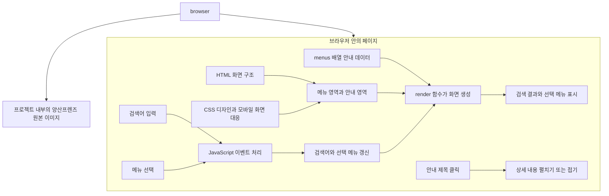

# 웅상 QR ON

웅상 QR ON은 영업을 준비하거나 운영하는 분이 영업신고와 위생 관련 안내를 쉽게 찾아볼 수 있도록 만든 웹페이지입니다. 페이지를 휴대전화에서 열거나 QR 코드로 연결해 필요한 정보를 확인하는 것을 목표로 합니다.

## 주요 기능

- 영업신고 구비서류, 업종별 시설기준, 위생교육, 온라인 민원, 관련 법령 안내
- 메뉴를 선택해 해당 주제의 안내 확인
- 검색어로 메뉴와 안내 내용 검색
- 안내 제목을 눌러 상세 내용 펼치기 및 접기
- 화면 크기에 맞춰 배치가 바뀌는 모바일 화면

## 실행 방법

별도 프로그램 설치나 빌드 과정은 필요하지 않습니다.

1. 프로젝트 폴더에서 `index.html`을 찾습니다.
2. 파일을 더블 클릭해 웹 브라우저에서 엽니다.

웹페이지를 다른 사람에게 공개하려면 웹 서버나 정적 웹 호스팅에 `index.html`을 올려야 합니다. QR 코드가 필요하다면 공개된 페이지 주소를 연결하는 QR 코드를 별도로 만들어 사용하세요.

## 파일 구성

```text
QR_ON/
├─ index.html   # 화면, 디자인, 안내 데이터와 동작이 들어 있는 페이지
└─ README.MD    # 프로젝트 설명서
```

현재 화면 디자인(CSS), 안내 내용(JavaScript), 페이지 구조(HTML)가 모두 `index.html`에 들어 있습니다. 별도의 라이브러리나 빌드 도구는 사용하지 않습니다.

## 페이지 아키텍처

이 페이지는 브라우저에서 바로 실행되는 간단한 구조입니다. 별도의 서버 프로그램이나 데이터베이스 없이 `index.html` 안의 안내 데이터를 화면에 표시합니다.



### 화면이 동작하는 순서

1. 브라우저가 HTML 구조와 CSS 디자인을 읽어 화면을 준비합니다.
2. JavaScript의 `menus` 배열에 적힌 안내 데이터를 `render()` 함수가 메뉴와 내용 영역에 표시합니다.
3. 검색어를 입력하거나 메뉴를 선택하면 화면에 필요한 상태를 바꾸고 다시 그립니다.
4. 안내 제목을 누르면 해당 상세 설명만 펼치거나 접습니다.

검색과 메뉴 선택은 JavaScript가 관리하고, 상세 설명 펼치기는 화면에서 바로 열고 닫습니다. 캐릭터 이미지는 `img/yangsan-friends/`의 로컬 파일을 사용합니다.

## 안내 내용 수정하기

`index.html` 아래쪽에서 `const menus = [`를 찾으면 메뉴와 안내 데이터를 확인할 수 있습니다. 메뉴는 `title`(메뉴 이름), `description`(메뉴 설명), `items`(상세 안내 목록)으로 이루어져 있습니다. 각 상세 안내는 `title`과 `detail`로 구성됩니다.

예를 들어 아래 항목의 제목이나 설명을 바꾸면 페이지에 표시되는 내용도 함께 바뀝니다.

```js
{
  title: "위생교육 안내",
  description: "영업자 위생교육의 대상과 이수 관련 정보를 확인하세요.",
  items: [
    { title: "신규 영업자 위생교육", detail: "교육 대상과 신청 방법을 확인하세요." }
  ]
}
```

새 메뉴를 추가할 때는 `menus` 배열 안에 같은 형식의 객체를 추가합니다. 메뉴와 안내를 검색하는 기능은 이 데이터의 제목과 설명도 함께 검색하므로 별도의 검색 목록을 수정할 필요가 없습니다.

## 이미지와 안내 정보 참고

- 양산프렌즈 캐릭터 이미지는 `img/yangsan-friends/`에 원본 그대로 보관하며 상단과 주요 안내 메뉴에 개별 캐릭터를 배치합니다. 비영리 목적·변형 없는 사용 조건과 양산시 출처·이용조건 안내를 페이지 하단에 표시합니다.
- 안내 문구는 기본적인 정보 탐색을 돕기 위한 내용입니다. 실제 구비서류와 시설기준은 업종과 영업 형태에 따라 달라질 수 있으므로, 신고 전에 최신 법령과 관할 기관의 안내를 확인해야 합니다.
- 안내 내용이나 캐릭터 이미지 출처를 변경한 뒤에는 브라우저에서 페이지를 새로고침해 정상적으로 표시되는지 확인하세요.